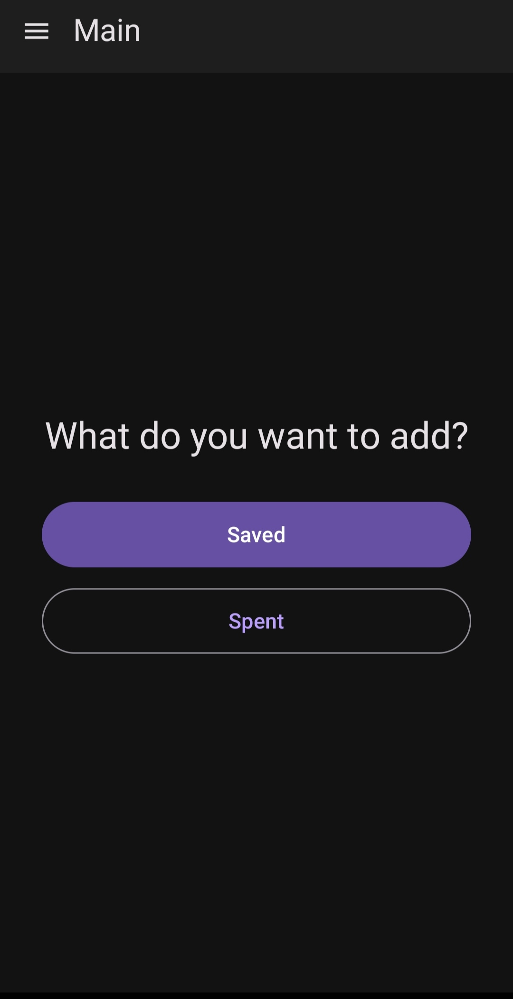
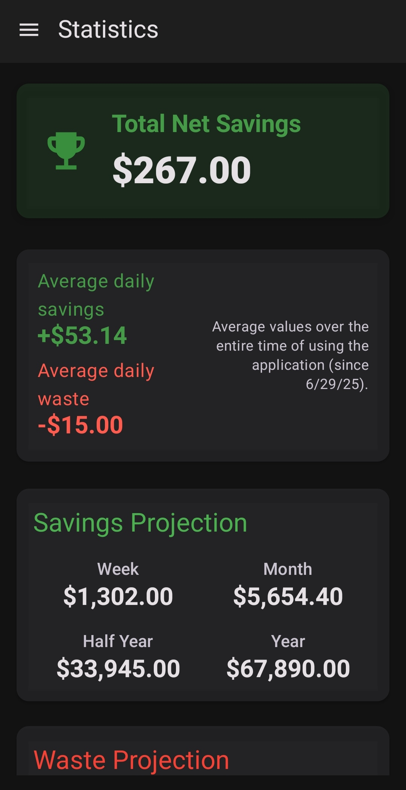
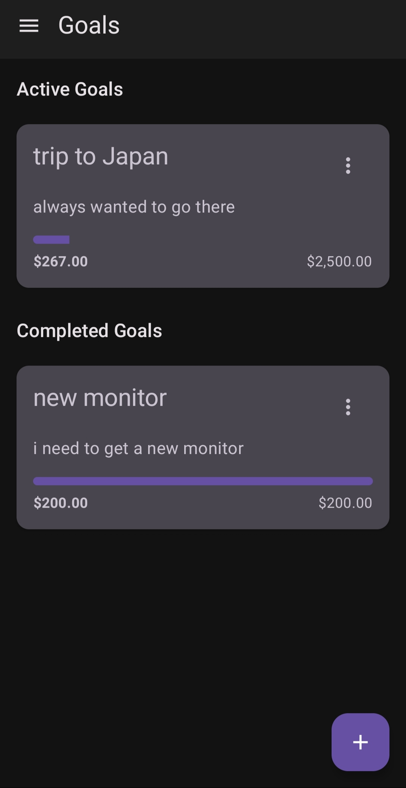
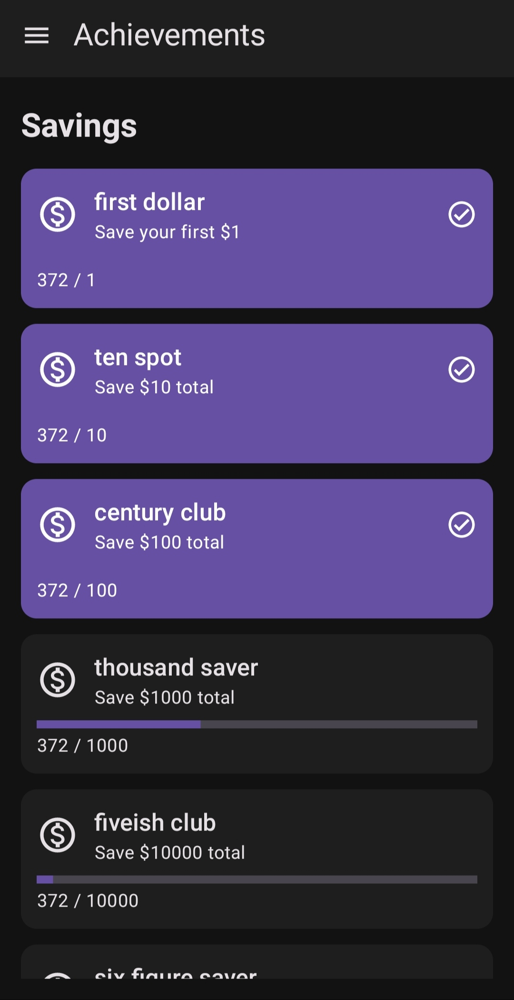

# NotBought 

A mobile app for tracking money saved by not buying unnecessary things.

## What it does

You know when you're about to buy something, then decide you don't actually need it? This app lets you track that "saved" money so you can see where it actually goes.

Add items you decided not to buy, and the app shows you:
- How much money you've saved over time
- Graphs and charts of your saving patterns  
- Your spending vs. saving trends

## Screenshots

  
  
  
  

  

## Why this matters

Most people forget about money they "saved" by not buying things. Without tracking, these savings become invisible and often get spent elsewhere without thinking about it.

## How to use

1. When you decide not to buy something, open the app
2. Add the item and amount you would have spent
3. View your savings progress in the dashboard
4. Compare with your actual spending to see patterns

